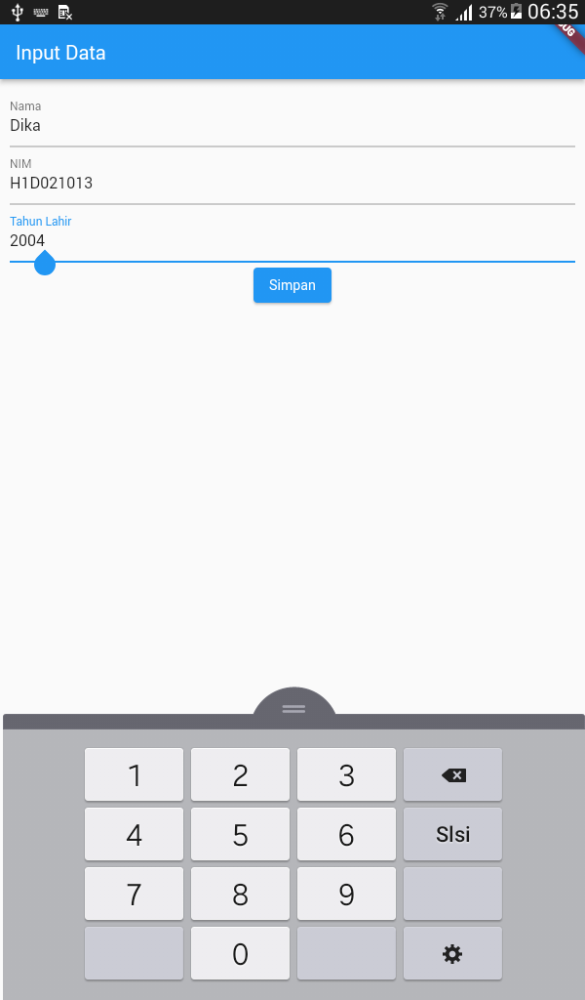

# Tugas Pertemuan 2

Fork dan clone repository ini, lalu jalankan perintah `flutter pub get`

Buatlah tampilan form yang berisi nama, nim, dan tahun lahir pada file `ui/form_data.dart`, lalu buatlah tampilan hasil dari input data tersebut pada file `ui/tampil_data.dart`

## Contoh

<h1>Hasil<h1>

Form Data 
  
Form Data 
